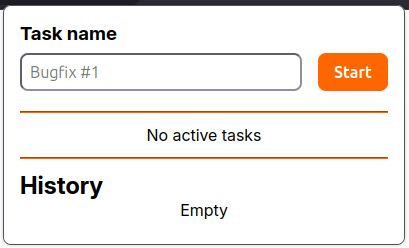
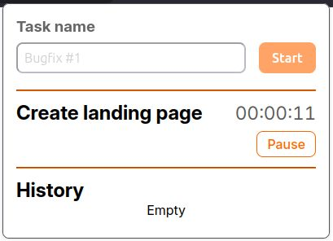
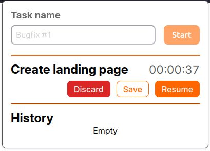
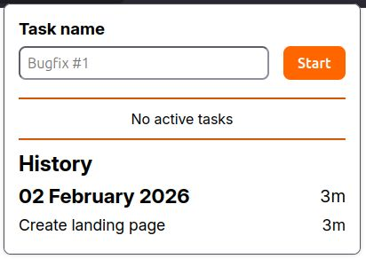

# Task Tracker
A minimalistic extension to track time spent on your tasks.

## Features
This extension allows to:
- Enter a task name and start it
- Pause a task
- Resume a task
- Discard a task
- Save task result to the history
- See history of previous tasks grouped by day
- Delete a record from history

## Installation
Task Tracker was tested to be working on Firefox and Chrome.
### Firefox
To install it on Firefox you can just use the [Firefox Add-ons page](https://addons.mozilla.org/en-US/firefox/addon/task-tracker-minimal/)
### Chrome
To use in Chrome you need to enable Developer mode on the chrome://extensions page and after pressing the "Load unpacked" button select this extension folder

---

This extension was not tested on any other browsers, but feel free to try it yourself :)

## Screenshots

